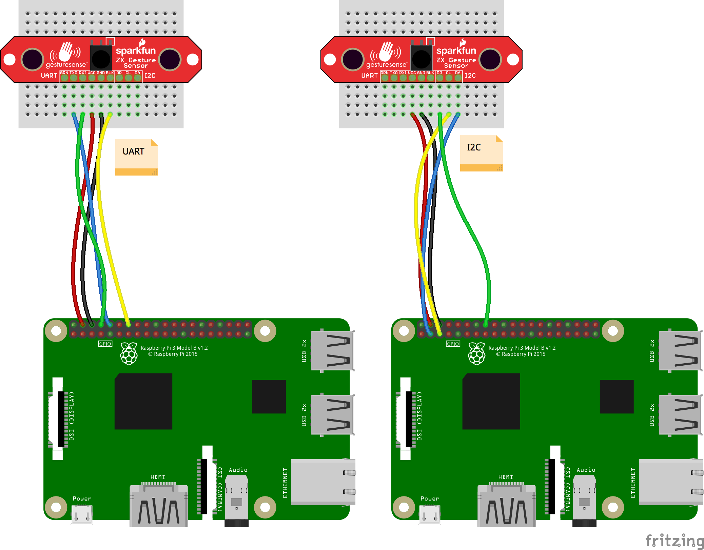

ZXSensor Sample for Android Things
==================================

This sample demonstrates how to control a ZXSensor using I2C or UART with
Android Things.

Pre-requisites
--------------

- Android Things compatible board
- Android Studio 2.2+
- the following individual components:
    - 1 [ZX Distance & Gesture Sensor](https://shop.pimoroni.com/products/zx-distance-and-gesture-sensor)
    - jumper wires
    - [Female headers](https://shop.pimoroni.com/products/female-headers)
    - 1 breadboard

Schematics
----------



Build and install
=================

On Android Studio, click on the "Run" button.

If you prefer to run on the command line, from this repository's root directory, type

```bash
./gradlew zxsensor:installDebug
adb shell am start com.blundell.zxsensor.example/.ZxSensorActivity
```

If you have everything set up correctly, when you swipe over the sensor a log will appear in Logcat.
